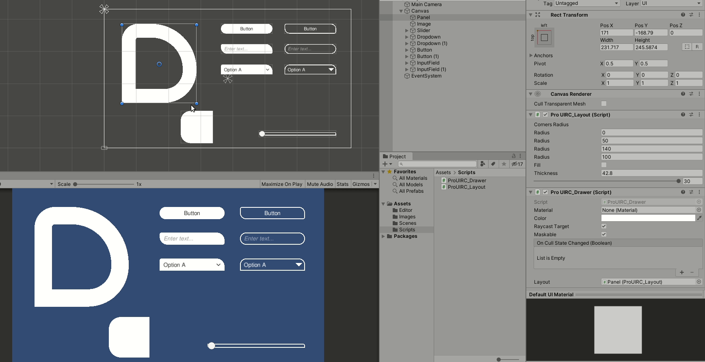

# Procedural-UI-Rounded-Corners-for-Unity
Procedurally generates UI panels with rounded corners. Overrides the Graphic component.

# Motivation
The project is a study for an inprovement on the UI system of the [Play Mode Blocks Engine](https://u3d.as/1FSH) asset for Unity.  

# Getting Started
1) Add the hole folder to your Unity project's *Asset* folder;
2) Add the ProUIRC_Layout component (located at *Scripts*) to the desired UI GameObject, ex.: Panel

# See In Action

# Credits
This project is based on CiaccoDavide's *Unity-UI-Polygon*.
Sourced from - https://github.com/CiaccoDavide/Unity-UI-Polygon
